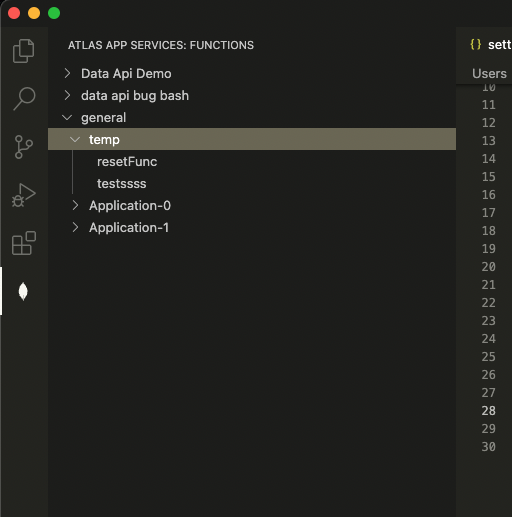
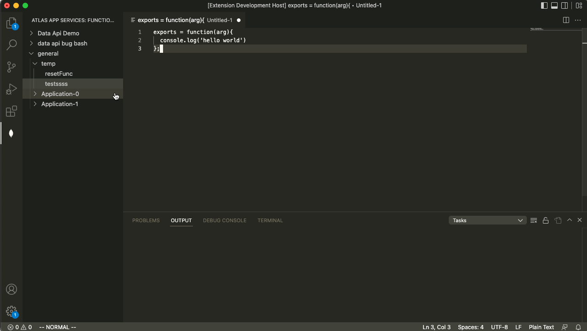

# Atlas App Services Functions

Easily develop, test, and run Atlas App Services functions from your IDE.

With this extension you can see all of the App Services functions available to you across your MongoDB Atlas projects and Apps. You can pull the existing source of those functions into your editor to modify and edit in your editor rather than through the online editor. While developing your function, you can also run it locally, without having to copy the code into the online function and validate that it is working.

## Features

### View existing functions
From the Atlas App Services extension icon, you can see all over your available projects and their respective Apps. Under each App are the existing functions. When you click on one, the source code for that function will be opened in a new editor within VSCode.

### Develop functions
From any open editor, you can run a function through Atlas App Services. Use the `Run Function` command, then select the project and App where you would like the function to run. You can find the value returned (or errors encounted) on the `Atlas App Services: Return` output frame. You can find log statements on the `Atlas App Services: Logs`.

## Requirements

You will need to have an existing MongoDB account and an Atlas cluster created. You will also need to have an Atlas App Services App created where your functions can be ran.

In order for the extension to be able to run functions and fetch your existing functions, you will need to create an API key. You can follow the instructions [here](https://www.mongodb.com/docs/atlas/configure-api-access/#grant-programmatic-access-to-service) to create an API key.

## Extension Settings

* `atlasAppServices.publicApiKey`: the public api key to access/administer your functions
* `atlasAppServices.privateApiKey`: the private api key to access/administer your functions
* `atlasAppServices.appServicesHostname`: the hostname where your App is hosted (i.e. 'https://realm.mongodb.com')
* `atlasAppServices.atlastHostname`: the hostname where your Atlast cluster is hosted (i.e. 'https://cloud.mongodb.com')
* `atlasAppServices.functionExecution`: the code that executes your function. Your function is named `exports` so you can call it by passing any arguments in to `exports(...args)`

## Known Issues

- In order for this to work, we need to loosen the CORS settings on BAAS. I had to adjust my local BAAS instance to allow all incoming hosts. This could possibly be more specific, but I haven't found docs on the specific host/port that VSCode makes requests from
   - An alternative solution would be to make public endpoints for the things that are fetched by this extension

## Release Notes

